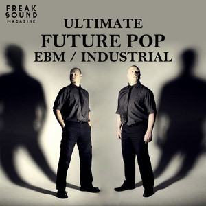
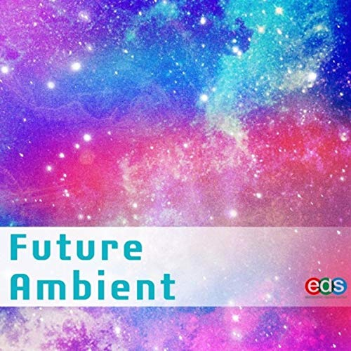
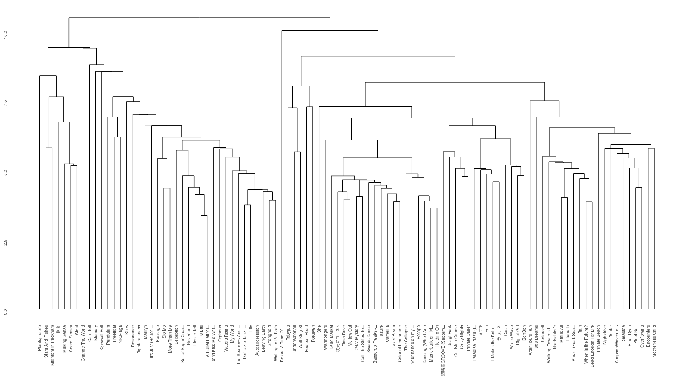

```{r source, echo = FALSE, messages = FALSE}
library(tidyverse)
library(tidymodels)
library(spotifyr)
library(plotly)
library(knitr)
library(compmus)
library(shiny)
library(ggdendro)
library(protoclust)
library(heatmaply)
library(network)
# Get playlist data
source("functions.r")
all_genres <- rbind(future_funk,kawaii_future_bass,futurepop,future_ambient,future_garage)
```

### An Introduction to Spotify's Genres of the Future {data-commentary-width=400}

<h1> Spotify's Genres of the Future - A Study on Spotify's Genre Classification</h1>

Spotify has several curious genres within its database, including some which are characterized by the word *future*. Namely, the following selection:

- Future Funk
- Kawaii Future Bass
- Futurepop
- Future Ambient
- Future Garage

It is definitely not clear if these genres are connected by something more than just their name. We'll explore why these genres are called the way the are, and if a (strong) connection might actually tie these genres together. This will consist of exploring the aspects of the music within each genre first, after which we will properly compare the 5 genres by defining a suitable corpus and providing insightful visualizations of the audio analysis data provided by the [Spotify API](https://www.rcharlie.com/spotifyr/), using some features provided by the [compmus R package](https://jaburgoyne.github.io/compmus/).

To begin our journey through the future, we take a look at the ability of statistical classifiers to differentiate between the five genres, using a k-neighbours classifier with variables extracted from a random forest classifying tactic. We will find that the Spotify API itself might not be suitable to finding a satisfying answer to our question, although it will tell us exactly how the genres are in fact quite different from each other.

Lets first take a step back however, and get acquainted with the genres and their surface level features.

<center>
<br><br>





</center>

***

<center>
<br>
Some sound samples from the different genres (in fact, these playlist together make up the entire corpus).
<br><br>
<iframe src="https://open.spotify.com/embed/user/bkd0b33gypt1ixtyg44x4y2ui/playlist/4a0xb2zui3hIPll7CMgeSu" width="300" height="80" frameborder="0" allowtransparency="true" allow="encrypted-media"></iframe>
<iframe src="https://open.spotify.com/embed/user/bkd0b33gypt1ixtyg44x4y2ui/playlist/75OfhBfc4tnQ8MFdiPiMcx" width="300" height="80" frameborder="0" allowtransparency="true" allow="encrypted-media"></iframe>
<iframe src="https://open.spotify.com/embed/user/bkd0b33gypt1ixtyg44x4y2ui/playlist/2dZ7eWcGRtuyseKY5QNZoP" width="300" height="80" frameborder="0" allowtransparency="true" allow="encrypted-media"></iframe>
<iframe src="https://open.spotify.com/embed/user/bkd0b33gypt1ixtyg44x4y2ui/playlist/2IgZ50kclGP2tNVx7mu9vL" width="300" height="80" frameborder="0" allowtransparency="true" allow="encrypted-media"></iframe>
<iframe src="https://open.spotify.com/embed/user/bkd0b33gypt1ixtyg44x4y2ui/playlist/1TBQdi8VdYsvruWv1W5HjB" width="300" height="80" frameborder="0" allowtransparency="true" allow="encrypted-media"></iframe>


</center>


### A Future of Sounds, Rhythms and Timbres - A Classification by Spotify's API features {data-commentary-width=600}

```{r random_forest}

# Prepare the data for classification
future_class <-
    recipe(playlist ~
               danceability +
               energy +
               loudness +
               speechiness +
               acousticness +
               instrumentalness +
               liveness +
               valence +
               tempo +
               duration_ms +
               C + `C#|Db` + D + `D#|Eb` +
               E + `F` + `F#|Gb` + G +
               `G#|Ab` + A + `A#|Bb` + B +
               c01 + c02 + c03 + c04 + c05 + c06 +
               c07 + c08 + c09 + c10 + c11 + c12,
           data = future_full) %>%
    step_center(all_predictors()) %>%
    # step_scale(all_predictors()) %>%
    step_range(all_predictors()) %>%
    prep(future_full) %>%
    juice

future_cv <- future_class %>% vfold_cv(5)

# Set up the random forest
future_forest <- rand_forest() %>% set_engine('randomForest')
predict_forest <- function(split)
    fit(future_forest, playlist ~ ., data = analysis(split)) %>%
    predict(assessment(split), type = 'class') %>%
    bind_cols(assessment(split))


# future_cv %>%
#     mutate(pred = map(splits, predict_forest)) %>%
#     unnest(pred) %>%
#     metric_set(accuracy, kap, j_index)(truth = playlist, estimate = .pred_class)


future_knn <- nearest_neighbor(neighbors = 1) %>% set_engine('kknn')
predict_knn_1 <- function(split)
    fit(future_knn, playlist ~ duration_ms + c01 + c02 + loudness + c03 + speechiness, data = analysis(split)) %>%
    predict(assessment(split), type = 'class') %>%
    bind_cols(assessment(split))

predict_knn_2 <- function(split)
    fit(future_knn, playlist ~ valence, data = analysis(split)) %>%
    predict(assessment(split), type = 'class') %>%
    bind_cols(assessment(split))
```


<h2>Random Forest Classification</h2>

```{r forest_plot}
# Plotting of the tree
forest_plot <- future_class %>%
    fit(future_forest, playlist ~ ., data = .) %>%
    pluck('fit') %>%
    randomForest::varImpPlot()

forest_plot <- as.data.frame(forest_plot)
forest_plot$varnames <- rownames(forest_plot) # row names to column
rownames(forest_plot) <- NULL
# forest_plot$var_categ <- rep(1:2, 5) # random var category

ggplot(forest_plot, aes(x=reorder(varnames, MeanDecreaseGini), y=MeanDecreaseGini)) +
    geom_point(color = "#772953") +
    geom_segment(aes(x=varnames,xend=varnames,y=0,yend=MeanDecreaseGini), color = "#E95420") +
    ylab("Importance Value") +
    xlab("Variable Name") +
    title("Importance of classification features") +
    coord_flip()
```

To start the classification process, we begin by applying random forest classification to our corpus. We immediately notice that most important variables in this model are not at all what we suspected in our preliminary analysis. The model the duration of the song and favors characteristics of the sound such as cepstro coefficient 1, which indicated loudness, cepstro coefficient 2, which indicates the brightness of the sound, and loudness again. Indeed, all these properties fluctuate from genre to genres, but they are not very insightful for our research question.

Nevertheless, we will use the top five variables for a k-neighbour classification from which the confusion matrix can be found below.

For our research this is of course useful information to know, but we are more interested in where these genres are similar. Aside from the none key-based properties, we can see that the forest classifier found acousticness and liveness to be _least_ important for classification. This leads us to a right path: the future is filled with low acousticness and liveness.

<br>

<h2>Naive K-neighbour Classification</h2>
In the ad hoc analysis we suspected valence and energy might be an important factors to differentiate between the genres. This was the motivation for the following k-neighbour classification and its respective confusion matrix. Apparently however, the classification does not do superbly well.

<h2>Random Forest Based K-neighbour Classification</h2>
We thereafter look at a k-neighbour classification using the top variables found during the random forest classification, which does significantly better than the naive model. Here we find some interesting results concerning which genre combinations the model is better at finding the correct classification. To begin, it achieves high accuracy for futurepop, indicating its unique nature between the five genres.

Secondly,

***


#### A Short Ad Hoc Examination of the Genres
__Future Funk and Kawaii Bass__

From exploring the genres and listening to some excerpts of their music, we can quickly suspect that the *future* description might mean something entirely different per genre. In the case of Future Funk and Kawaii Future Bass, it seems to refer to a futuristic pop-y sound, with a distinct electronic feel, although real (sampled) instruments and some vocals (often with light-hearted lyrics) now and then are common too, especially in Future Funk. Future Kawaii Bass sets itself apart from Future Funk with extensive use of *chiptune* sounds and strong upbeat rhythms.

__Futurepop__

Futurepop lies on the complete other end of the spectrum however, with dark low synths and rhythms characterizing
its sound. These support raw, unedited vocals with lyrics I could only describe as "desperate".
I believe that if the *Future* in its name refers to anything else than the extensive usage of synthesized sounds,
it would refer to a distinctively dystopian and dark impression of the future.

__Future Garage and Future Ambient__

Future Garage and Future Ambient could both in a certain way be described as minimalistic.
They use little instruments, which often repeat short musical fragments throughout the whole song in
a relatively low tempo. Strong drum grooves give structure to the songs, in which generally no distinctive
melody or vocal part is present, especially in Future Ambient. There, slow reverberized synth sounds and
sweeps give color to tracks. In this regard, Future Garage is certainly different. It features these synths
too, but also contains a lot more acoustic "real" instruments, albeit often sampled, and the occasional
"smooth" melody line. For both genres, the *Future* seems simply to be an indication of the electronic
style and heavy usage of sampling.

#### The Creation of the Corpus

The collections of songs we'll analyze, our corpus, will naturally be a selection of songs from artist
from each of these genres. Large names such as Snail's House (who has in fact been credited to be the pioneer
of Kawaii Future Bass, but is also listed as a Future Funk artist) will be of particular interest and multiple
songs will be included, but some genres such as future ambient consist of mostly smaller artist, where a smaller
and more varied selection of songs from different artist is more appropriate.

It could also be helpful to compare some of the outliers of the genre, but care must be taken to ensure those
artist would actually belong to the genre, instead of their appearance being based solely on Spotify's
automatic assignment. If not, it will be more useful to exclude them from the research, as they would
negatively interfere with making valid comparisons between the genres.

I ended up putting together a playlist for every genre based on playlists provided by the Every Noise at Once website (http://everynoise.com/), each around 50 tracks long. The Every Noise at Once website is a large compilation of all genres on Spotify, and should give a representative selection of songs for each genres, at least according to Spotify's own genre classification algorithms.


```{r corpus_table, echo = FALSE}
# TODO: table with corpus (might redefine the corpus if I have time)
kable(all_genres %>% group_by(Genre) %>% summarize('Song Count'=n()),
      caption = "The song count for the five genres")

```


#### Naive K-neighbour Classification

```{r naive-confusion}
future_cv %>%
    mutate(pred = map(splits, predict_knn_2)) %>% unnest(pred) %>%
    conf_mat(truth = playlist, estimate = .pred_class) %>%
    autoplot(type = 'heatmap')
```

#### Random Forest Based K-neighbour Classification

```{r better-confusion}
future_cv %>%
    mutate(pred = map(splits, predict_knn_1)) %>% unnest(pred) %>%
    conf_mat(truth = playlist, estimate = .pred_class) %>%
    autoplot(type = 'heatmap', color="orange")
```


### Applying Clustering to the Genres

```{r clustering1, out.width = '80%'}
future_unique <- future_full %>% mutate(track_name = str_trunc(track_name, 20))
future_unique <- future_unique[!duplicated(future_unique$track_name),]
future_unique <- sample_n(future_unique, 100)

future_juice <-
    recipe(track_name ~
               danceability +
               energy +
               loudness +
               speechiness +
               acousticness +
               instrumentalness +
               liveness +
               valence +
               tempo +
               duration_ms +
               C + `C#|Db` + D + `D#|Eb` +
               E + `F` + `F#|Gb` + G +
               `G#|Ab` + A + `A#|Bb` + B +
               c01 + c02 + c03 + c04 + c05 + c06 +
               c07 + c08 + c09 + c10 + c11 + c12,
           data = future_unique) %>%
    step_center(all_predictors()) %>%
    step_scale(all_predictors()) %>%
    # step_range(all_predictors()) %>%
    prep(future_unique) %>%
    juice %>%
    column_to_rownames('track_name')

future_dist <- dist(future_juice, method = 'euclidean')

# protoclust(future_dist) %>% dendro_data() %>% ggdendrogram()
```


***

Clustering shows

### First Investigations

```{r plot_scatter1, echo = FALSE}
# Make some plots
scatter <- ggplot(all_genres,aes(x=Genre,size=Liveness,color=Energy)) +
    geom_jitter(aes(y=Valence)) +
    geom_bar(aes(x=Genre,y=Valence),alpha=0.3,stat="summary") +
    scale_colour_gradient(high = "#772953", low = "#E95420")
danceability <- ggplot(all_genres,aes(color=Genre)) + geom_freqpoly(binwidth=0.15,aes(x=Danceability),size=1)
valence <- ggplot(all_genres,aes(color=Genre)) + geom_freqpoly(binwidth=0.15,aes(x=Valence),size=1)
energy <- ggplot(all_genres,aes(color=Genre)) + geom_freqpoly(binwidth=0.15,aes(x=Energy),size=1)

ggplotly(scatter)
```

***


#### Description
An important finding of our preleminary research was the large devations of musical style between the genres. To me, valence seemed to be a logical choice for comparison, as I felt like the genres sounded most distict in this regard. The graph shows the average valence of the songs from each genre, as well as the value of each individual song in the form of a scatter plot. Additionally, the colour displays the energy value of the tracks, another feature I felt would provide contrast between the genres. Lastly, the size of each point gives an indication of the liveness of the track, as provided by Spotify.

#### Results
Surprisingly, we can see Futurepop actually has a somewhat high average, even higher than Kawaii Future Bass, something I think one would not concluded based on listening to the selections. As expected, Future Funk and Kawaii Future Bass do in general seem to be assigned higher valence values than Future Ambient and Future Garage.


### Chroma, Cesptro and Chord Features {data-commentary-width=600}

```{r chroma_cepstro_chord}

kfb_milk <- get_analysis('4mCwspCTPF1aoWUNxsS5aD')
ff_sunset <- get_analysis('0DvqAXyoA7zRB8wgH0DjRO')
fp_forever <- get_analysis('47Gqy79zgQgvqIvjpkAcXE')
fg_king <- get_analysis('6f1S3mOpU4TeoTZOJCmRXl')
fa_freefloat <- get_analysis('5DJhoqNPXKVHmRNk9VXiZd')


fp_chroma <- plot_chroma(fp_forever)   + ggtitle("Forever (Original Club Mix) - Chromagram")
ff_chroma <- plot_chroma(ff_sunset)    + ggtitle("Ji-Eun's Sunset - Chromagram")
kfb_chroma <- plot_chroma(kfb_milk)    + ggtitle("Hot Milk - Chromagram")
fg_chroma <- plot_chroma(fg_king)      + ggtitle("King Bromeliad - Chromagram")
fa_chroma <- plot_chroma(fa_freefloat) + ggtitle("Freefloat - Chromagram")

fp_cesptro <- plot_cesptro(fp_forever)   + ggtitle("Forever (Original Club Mix) - Cepstrogram")
ff_cesptro <- plot_cesptro(ff_sunset)    + ggtitle("Ji-Eun's Sunset - Cepstrogram")
kfb_cesptro <- plot_cesptro(kfb_milk)    + ggtitle("Hot Milk - Cepstrogram")
fg_cesptro <- plot_cesptro(fg_king)      + ggtitle("King Bromeliad - Cepstrogram")
fa_cesptro <- plot_cesptro(fa_freefloat) + ggtitle("Freefloat - Cepstrogram")

fp_chord <- plot_chord(fp_forever)   + ggtitle("Forever (Original Club Mix) - Chordogram")
ff_chord <- plot_chord(ff_sunset)    + ggtitle("Ji-Eun's Sunset - Chordogram")
kfb_chord <- plot_chord(kfb_milk)    + ggtitle("Hot Milk - Chordogram")
fg_chord <- plot_chord(fg_king)      + ggtitle("King Bromeliad - Chordogram")
fa_chord <- plot_chord(fa_freefloat) + ggtitle("Freefloat - Chordogram")
```

<style>
.tab-button {
  background-color: #E95420;
  border: none;
  color: white;
  padding: 10px 10px;
  text-align: center;
  text-decoration: none;
  display: inline-block;
  font-size: 16px;
  margin: 4px 1px;
  cursor: pointer;
  transition-duration: 0.1s;
}

.tab-button:hover {
  background-color: #772953;
  color: white;
}

.chroma {
  animation: fadeIn 0.5s;
}

.chromahidden {
  animation: fadeOut 0.5s;
}

@keyframes fadeIn {
  from {opacity: 0;}
  to {opacity: 1;}
}
@keyframes fadeOut {
  from {opacity: 1;}
  to {opacity: 0;}
}

</style>

<script>
function openChroma(name) {
  var i;
  var divs = document.getElementsByClassName("chroma");
  for (i = 0; i < divs.length; i++) {
    divs[i].style.display = "none";
  }
  document.getElementById(name).style.display = "block";
}
</script>
<center>

<div id="kfb" class="chroma" height="100%">
```{r out.width = '80%'}
kfb_chroma
```
<hr>
```{r out.width = '80%'}
kfb_cesptro
```
<hr>
```{r out.width = '80%'}
kfb_chord
```
</div>
<div id="ff" class="chroma" style="display:none">
```{r out.width = '80%'}
ff_chroma
```
<hr>
```{r out.width = '80%'}
ff_cesptro
```
<hr>
```{r out.width = '80%'}
ff_chord
```
</div>
<div id="fg" class="chroma" style="display:none">
```{r out.width = '80%'}
fg_chroma
```
<hr>
```{r out.width = '80%'}
fg_cesptro
```
<hr>
```{r out.width = '80%'}
fg_chord
```
</div>
<div id="fa" class="chroma" style="display:none">
```{r out.width = '80%'}
fa_chroma
```
<hr>
```{r out.width = '80%'}
fa_cesptro
```
<hr>
```{r out.width = '80%'}
fa_chord
```
</div>
<div id="fp" class="chroma" style="display:none">
```{r out.width = '80%'}
fp_chroma
```
<hr>
```{r out.width = '80%'}
fp_cesptro
```
<hr>
```{r out.width = '80%'}
fp_chord
```

</div>
</center>

***

#### Description
Here we can see a chromagram, cepstrogram and chordogram of a single somewhat representative song for every genre.
The songs are picked by hand, which ensures a totally subjective view of every genre, but I think it can be a
useful tool for analysis nonetheless.
In no particular order, these songs are:

 - Forever (Original Club Mix) - Bruderschaft (Futurepop)
 - Ji-Eun's Sunset - City Girl (Future Funk)
 - Hot Milk - Snail's House (Kawaii Future Bass)
 - King Bromeliad - Floating Points (Future Garage)
 - Freefloat - Aural Float (Future Ambient)

Each song is compared using the same norm to allow for fair comparisons.

<center>
<nav class="tab" width="50%">
    <button class="tab-button" onclick="openChroma('ff')">Future Funk</button>
    <button class="tab-button" onclick="openChroma('kfb')">Kawaii Future Base</button>
    <button class="tab-button" onclick="openChroma('fg')">Future Garage</button>
    <button class="tab-button" onclick="openChroma('fa')">Future Ambient</button>
    <button class="tab-button" onclick="openChroma('fp')">Futurepop</button>
</nav>
</center>

The first thing one may notice is the differences in repetitions between the genres. The Future Garage song
especially has a very homogeneous structure judging from the three c-grams. Future Ambient is similar, but seems
to have two different sections which both show a lot of individual repetition.


### What makes the 'future', the _future_? - Conclusion

We have found
